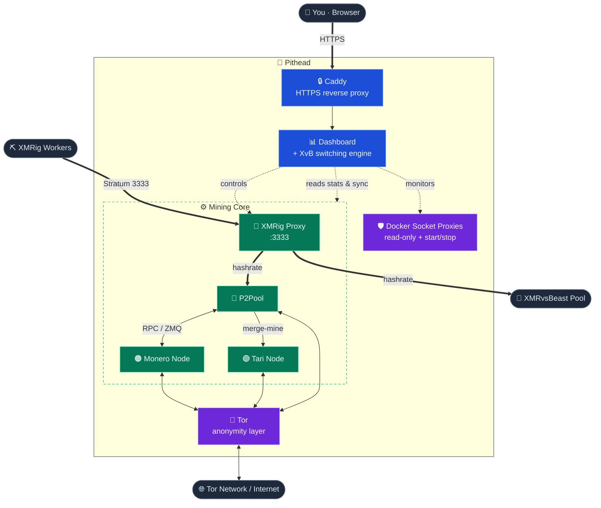

<div align="center">


# Pithead

### Private Monero + Tari merge mining, the whole stack, in one command

[](https://github.com/p2pool-starter-stack/pithead/actions/workflows/ci.yml)
[](./LICENSE)


A containerized stack for running a private [Monero](https://www.getmonero.org/) full node,
[P2Pool](https://github.com/SChernykh/p2pool), and [Tari](https://www.tari.com/) merge mining. It's
built for privacy and performance, and the interactive setup takes you from clone to mining in a few
minutes.

<picture>
  <source media="(prefers-color-scheme: dark)" srcset="./images/launch/hero.png">
  
</picture>

</div>

---

## ✨ Why this stack?

- ⛏️ **Zero-fee, decentralized payouts.** Mine Monero on [P2Pool](https://p2pool.io/) — no pool
  operator, no fees, rewards paid straight to your own wallet — and every hash **merge-mines Tari
  for free**: a second payout for zero extra power or config.
- 🧠 **Set-and-forget yield optimizer.** An algorithmic engine watches the XMRvsBeast raffle and
  shifts hashrate to catch bonus rounds, donating only the minimum needed to hold your tier and
  handing every spare cycle back to your own P2Pool payouts. It tunes itself, and it won't
  over-donate.
- 🧅 **Tor-first.** A built-in Tor daemon gives Monero, Tari, and P2Pool onion addresses, so your
  router stays closed and your home IP is never advertised to an inbound peer. (Two outbound yield
  paths still touch clearnet in v1.0; the [privacy guide](docs/privacy.md) maps every connection and
  how to harden it today.)
- 🔌 **One endpoint for every rig.** Point all your workers at a single address. Wallets and per-rig
  pool config stay out of the miner entirely — the stack routes the hashrate for you.
- 📊 **A dashboard worth leaving open.** Watch live hashrate, your P2Pool/XvB split shading in real
  time, the PPLNS window, and every worker update, served over HTTPS on your LAN.
- 🚀 **One-command setup.** An interactive script handles dependencies, config, Tor, and (on Linux)
  RandomX kernel tuning. It asks before touching GRUB, then offers to start everything for you.
- 🔒 **Hardened.** Least-privilege containers, SHA256-verified binaries, pinned versions,
  localhost-only RPC, and least-privilege Docker socket proxies (a read-only one for stats, plus a
  separate start/stop-only one for node-down worker failover).

---

## 🚀 Quick Start

```bash
# Grab the latest release — pulls the published, tested images (no local build)
curl -fsSL https://github.com/p2pool-starter-stack/pithead/releases/latest/download/pithead.tar.gz | tar xz
cd pithead
cp config.json.template config.json   # then set your Monero + Tari payout addresses
./pithead setup
```

> Want every tunable? Copy `config.advanced.example.json` instead. Prefer to build from source (a
> `dev` build) — e.g. to contribute? See [Install from source](docs/getting-started.md#alternative-build-from-source).

> **Prereqs:** Ubuntu Server **24.04 LTS**, **16 GB+ RAM**, an **SSD** (~300 GB pruned / ~500 GB
> full minimum — the chains grow ~100+ GB/year, so 2–4 TB is the set-and-forget choice), and your
> **Monero + Tari payout addresses** handy — full sizing in [Hardware Requirements](docs/hardware.md).

`setup` checks dependencies (and offers to install them on Ubuntu), asks for your wallet
addresses, provisions Tor, tunes the kernel for RandomX, and offers to start the stack. Then:

1. **Open the dashboard** at `https://<your-hostname>` (the script prints the exact URL).
2. **Let it sync.** On first boot the dashboard shows **Sync Mode** while your Monero and Tari
   nodes catch up to the network — it switches to the live view automatically once synced. p2pool
   and the proxy stay parked until then, so the sync logs stay clean.
3. **Connect your miners** by pointing any [XMRig](https://github.com/xmrig/xmrig) rig at
   `YOUR_STACK_IP:3333` (no wallet address needed). New to mining?
   [RigForge](https://github.com/p2pool-starter-stack/rigforge) provisions a tuned worker in one
   command.

<div align="center">
  
</div>

📖 **Full walkthrough:** [docs/getting-started.md](docs/getting-started.md)

> **Already have a synced Monero node?** Skip the wait by pointing the stack at your existing
> blockchain — see [Reusing an existing node](docs/configuration.md#reusing-an-existing-node).

---

## 📚 Documentation

| Guide | What's inside |
|---|---|
| **[Getting Started](docs/getting-started.md)** | Prerequisites, install, first-run setup, and what to expect while the node syncs. |
| **[Hardware Requirements](docs/hardware.md)** | Minimum vs. recommended specs for the **stack host** — CPU, RAM, disk, network — and how to run leaner. (Miner specs live in [RigForge](https://github.com/p2pool-starter-stack/rigforge).) |
| **[Configuration](docs/configuration.md)** | Every `config.json` key, applying changes safely, reusing an existing node, and remote Monero nodes. |
| **[The Dashboard](docs/dashboard.md)** | Sync Mode and a tour of the live operational view. |
| **[Connecting Miners](docs/workers.md)** | Point any existing rig at the stack, or spin up a tuned miner with [RigForge](https://github.com/p2pool-starter-stack/rigforge). |
| **[Architecture](docs/architecture.md)** | The nine services, the privacy model, and the algorithmic XvB switching engine. |
| **[Privacy & Network Egress](docs/privacy.md)** | Every off-box connection — what's Tor-routed, what's clearnet today, and how to harden it. |
| **[Operations & Maintenance](docs/operations.md)** | Full command reference, upgrades, backups, and troubleshooting. |

Browse the full index at **[docs/](docs/README.md)**.

---

## 🏗️ How it works

The stack orchestrates nine services via Docker Compose: a Monero **full node**, **P2Pool**, a
**Tari** base node, an **XMRig proxy** (your single worker endpoint), **Tor** for anonymity, the
**dashboard** + switching engine, a read-only **Docker socket proxy** (plus a tiny start/stop-only
control proxy), and **Caddy** for HTTPS.



Read the full breakdown — including the privacy model and the algorithmic switching engine — in
**[Architecture](docs/architecture.md)**.

---

## 🛠️ Common commands

Everything runs through `pithead` (`./pithead help` lists it all):

| Command | Description |
|---|---|
| `./pithead setup` | First-time interactive setup. |
| `./pithead apply` | Preview and apply `config.json` changes. |
| `./pithead up` / `down` / `restart` | Start / stop / restart the stack. |
| `./pithead upgrade` | Re-render config, then pull (bundle) or rebuild (source) the images and restart — see [Updating](docs/operations.md#updating-the-stack). |
| `./pithead logs [service]` | Follow logs (all, or one service). |
| `./pithead status` | Container status + health-check of every expected service (warns on anything down). |
| `./pithead doctor` | Read-only health report (deps, Docker, AVX2, HugePages, RAM/disk, onion state). |
| `./pithead backup` | Save config, secrets, the Tor onion keys, and the dashboard's database to `backups/` (`--with-chains` adds blockchain data; `-y` / `--yes` skips the prompts). |
| `./pithead restore <archive>` | Restore those files from a backup archive (asks before overwriting; `-y` / `--yes` skips the prompt). |

Full reference: **[Operations & Maintenance](docs/operations.md)**.

---

## 🤝 Donate

If this stack saved you time and you'd like to support it, donations to this XMR wallet are
appreciated:

```
486aGn4qhH1MkaASjnEWMDN7stD1SVtPF5fvihmjffeBE5ACL1u1jU95KxiqmoiaPZMexi4R4W11MLXut66XWVVF8wjAE5R
```

## 📄 License

Pithead's own code is provided "as-is" under the [MIT License](./LICENSE). Bundled
third-party components keep their own licenses (two — `p2pool`, `xmrig-proxy` — are GPLv3,
shipped unmodified as separate containers) — see
[`THIRD_PARTY_LICENSES.md`](./THIRD_PARTY_LICENSES.md).
