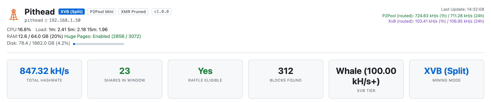
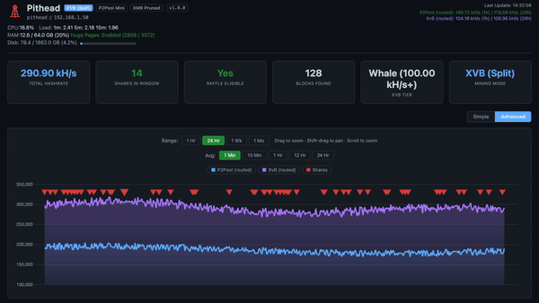

<div align="center">


# Pithead

### Private Monero + Tari merge-mining stack

[](https://github.com/p2pool-starter-stack/pithead/actions/workflows/ci.yml)
[](./LICENSE)


Docker Compose stack for Monero + Tari merge-mining on [P2Pool](https://github.com/SChernykh/p2pool),
with a [Monero](https://www.getmonero.org/) full node, [Tari](https://www.tari.com/) base node, and
a Tor daemon. The `pithead` script renders config, provisions Tor, and drives docker-compose.

<picture>
  <source media="(prefers-color-scheme: dark)" srcset="./images/launch/hero.png">
  
</picture>

</div>

---

## What it does

- ⛏️ **P2Pool payouts, Tari merge-mined.** Mines Monero on [P2Pool](https://p2pool.io/): no pool
  operator, no fee, rewards paid to your own wallet. Every hash merge-mines Tari on the same work.
- 🧠 **XvB switching engine.** Watches the XMRvsBeast raffle and shifts hashrate to hold your tier,
  donating the minimum needed and routing the rest to your P2Pool payouts.
- 🧅 **Tor-first networking.** A built-in Tor daemon gives Monero, Tari, and P2Pool onion addresses;
  a host firewall drops any direct clearnet dial from the stack. All runtime egress routes over Tor
  by default — the one opt-in exception is clearnet initial sync. The [privacy
  guide](docs/privacy.md) maps every connection.
- 🔌 **One endpoint for every rig.** Point all workers at a single address on port `3333`. No wallet
  address in the miner config; the stack routes the hashrate.
- 📊 **Live dashboard.** Hashrate, the P2Pool/XvB split, the PPLNS window, and per-worker updates,
  served over HTTPS on your LAN.
- 📟 **Telegram operator bot.** Opt-in alerts for a downed node, a worker that dropped off, sync
  finishing, low disk, a clearnet leak, or a sustained hashrate drop — plus a daily digest and
  read-only commands (`/status`, `/hashrate`, `/workers`, `/earnings`). Routed over Tor. See the
  [Telegram guide](docs/telegram.md).
- 🔔 **Dead-man's switch.** An optional [Healthchecks.io](https://healthchecks.io/) ping tells you
  when the whole box goes dark — the one failure a monitor running *on* that box can never report.
- 🚀 **Interactive setup.** `./pithead setup` checks dependencies, writes config, provisions Tor, and
  (on Linux) tunes HugePages for RandomX. It prompts before any GRUB change, then offers to start.
- 🔒 **Hardened defaults.** Non-root containers, SHA256-verified binaries, digest-pinned base and
  third-party images, localhost-only RPC, and two scoped Docker socket proxies: a read-only one for
  stats and a separate start/stop-only one for node-down worker failover.

---

## 🚀 Quick Start

```bash
# Grab the latest release — pulls the published, tested images (no local build)
curl -fsSL https://github.com/p2pool-starter-stack/pithead/releases/latest/download/pithead.tar.gz | tar xz
cd pithead
cp config.minimal.json config.json   # then set your Monero + Tari payout addresses
./pithead setup
```

> For every tunable, copy `config.reference.json` instead. To build from source (a `dev`
> build), e.g. to contribute, see [Install from source](docs/getting-started.md#alternative-build-from-source).

> NOTE: Prereqs are Ubuntu Server 24.04 LTS, 16 GB+ RAM, an SSD (~300 GB pruned / ~500 GB full
> minimum; the chains grow ~100+ GB/year, so 2–4 TB avoids a later resize), and your Monero + Tari
> payout addresses. Full sizing in [Hardware Requirements](docs/hardware.md).

`setup` checks dependencies (and offers to install them on Ubuntu), asks for your wallet
addresses, provisions Tor, tunes HugePages for RandomX, and offers to start the stack. Then:

1. Open the dashboard at `https://<your-hostname>` (the script prints the exact URL).
2. Wait for the initial sync. On first boot the dashboard shows Sync Mode while the Monero and Tari
   nodes catch up, then switches to the live view once both are synced. p2pool and the proxy stay
   parked until then.
3. Point any [XMRig](https://github.com/xmrig/xmrig) rig at `YOUR_STACK_IP:3333` — no wallet
   address in the miner. [RigForge](https://github.com/p2pool-starter-stack/rigforge) provisions a
   tuned worker in one command.

<div align="center">
  
</div>

Full walkthrough: [docs/getting-started.md](docs/getting-started.md)

> NOTE: Already have a synced Monero node? Point the stack at your existing blockchain to skip the
> wait. See [Reusing an existing node](docs/configuration.md#reusing-an-existing-node).

---

## 📚 Documentation

| Guide | What's inside |
|---|---|
| **[Getting Started](docs/getting-started.md)** | Prerequisites, install, first-run setup, and what to expect while the node syncs. |
| **[Hardware Requirements](docs/hardware.md)** | Minimum vs. recommended specs for the stack host (CPU, RAM, disk, network), and how to run leaner. (Miner specs live in [RigForge](https://github.com/p2pool-starter-stack/rigforge).) |
| **[Configuration](docs/configuration.md)** | Every `config.json` key, applying changes safely, reusing an existing node, and remote Monero nodes. |
| **[The Dashboard](docs/dashboard.md)** | Sync Mode and a tour of the live operational view. |
| **[Connecting Miners](docs/workers.md)** | Point any existing rig at the stack, or spin up a tuned miner with [RigForge](https://github.com/p2pool-starter-stack/rigforge). |
| **[Architecture](docs/architecture.md)** | The nine services, the privacy model, and the algorithmic XvB switching engine. |
| **[Privacy & Network Egress](docs/privacy.md)** | Every off-box connection: what's Tor-routed, what's clearnet today, and how to harden it. |
| **[Operations & Maintenance](docs/operations.md)** | Full command reference, upgrades, backups, and troubleshooting. |

Browse the full index at **[docs/](docs/README.md)**.

---

## 🏗️ How it works

The stack orchestrates nine services via Docker Compose: a Monero full node, P2Pool, a Tari base
node, an XMRig proxy (your single worker endpoint), Tor for anonymity, the dashboard plus switching
engine, a read-only Docker socket proxy (plus a tiny start/stop-only control proxy), and Caddy for
HTTPS.


Read the full breakdown, including the privacy model and the algorithmic switching engine, in
[Architecture](docs/architecture.md).

---

## 🛠️ Common commands

Everything runs through `pithead` (`./pithead help` lists it all):

| Command | Description |
|---|---|
| `./pithead setup` | First-time interactive setup. |
| `./pithead apply` | Preview and apply `config.json` changes. |
| `./pithead up` / `down` / `restart` | Start / stop / restart the stack. |
| `./pithead upgrade` | Re-render config, then pull (bundle) or rebuild (source) the images and restart — see [Updating](docs/operations.md#updating-the-stack). |
| `./pithead logs [service]` | Follow logs (all, or one service). |
| `./pithead status` | Container status + health-check of every expected service (warns on anything down). |
| `./pithead doctor` | Read-only health report (deps, Docker, AVX2, HugePages, RAM/disk, onion state). |
| `./pithead backup` | Save config, secrets, the Tor onion keys, and the dashboard's database to `backups/` (`--with-chains` adds blockchain data; `-y` / `--yes` skips the prompts). |
| `./pithead restore <archive>` | Restore those files from a backup archive (asks before overwriting; `-y` / `--yes` skips the prompt). |

Full reference: **[Operations & Maintenance](docs/operations.md)**.

---

## 🤝 Donate

If this stack saved you time, donations to this XMR wallet are appreciated:

```
486aGn4qhH1MkaASjnEWMDN7stD1SVtPF5fvihmjffeBE5ACL1u1jU95KxiqmoiaPZMexi4R4W11MLXut66XWVVF8wjAE5R
```

## 📄 License

Pithead's own code is provided "as-is" under the [MIT License](./LICENSE). Bundled
third-party components keep their own licenses (two, `p2pool` and `xmrig-proxy`, are GPLv3,
shipped unmodified as separate containers). See
[`THIRD_PARTY_LICENSES.md`](./THIRD_PARTY_LICENSES.md).
