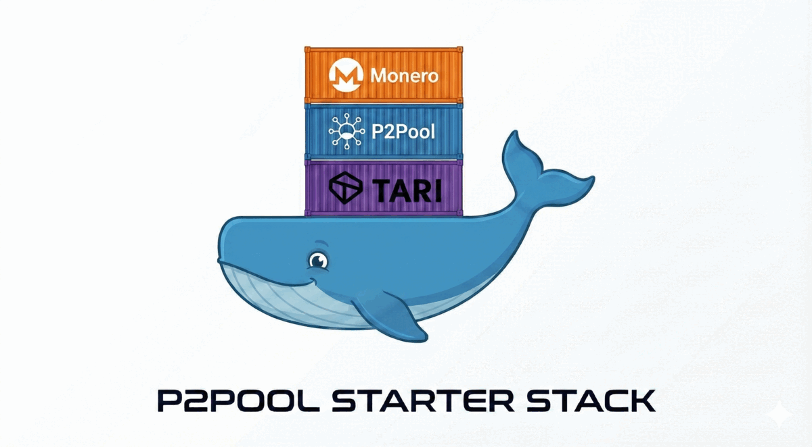
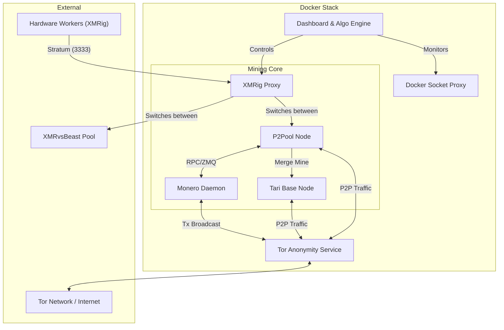

# P2Pool Starter Stack: Monero & Tari Merge Mining


A professional-grade, containerized infrastructure for running a private [Monero](https://www.getmonero.org/) full node, [P2Pool](https://github.com/SChernykh/p2pool), and [Tari](https://www.tari.com/) merge mining. This stack is engineered for maximum privacy ([Tor](https://www.torproject.org/)-only networking), hardware efficiency (HugePages/RandomX optimization), and ease of management via an interactive deployment script and bespoke dashboard.

## 🌟 Features
*   **Privacy by Design:** Integrated Tor daemon provides hidden services (Onion addresses) for Monero, Tari, and P2Pool. No public IPv4 port forwarding required.
*   **Merge Mining:** Automatically mines Tari (Minotari) alongside Monero via P2Pool sidechain integration.
*   **Smart Yield Optimization:** An algorithmic switching engine optimizes hashrate allocation between P2Pool and XMRvsBeast bonus rounds to maximize your yield.
*   **Simplified Worker Configuration:** A single endpoint for all your workers. The stack intelligently routes hashrate upstream.
*   **Real-time Dashboard:** A custom web UI provides at-a-glance monitoring of your entire mining operation, including hashrate, PPLNS window, and worker status.
*   **Effortless Deployment:** An interactive script handles setup, configuration, and kernel optimizations, getting you started in minutes.
*   **Robust & Secure:** All services are containerized. Binaries are verified via SHA256 hashes during build, and services run with least-privilege users where applicable.

## 🏗️ Architecture
The stack orchestrates eight primary services via Docker Compose:
1.  **Monerod:** The Monero daemon (Full Node). Configured for restricted RPC and Tor transaction broadcasting.
2.  **P2Pool:** The decentralized mining sidechain, with support for Main, Mini, and Nano pools.
3.  **Tari Base Node:** The Minotari node for merge mining with Monero.
4.  **XMRig Proxy:** A central connection point for all your mining hardware.
5.  **Tor:** A centralized anonymity layer providing SOCKS5 proxies and Hidden Services for all containers.
6.  **Dashboard:** The web-based monitoring UI and algorithmic switching engine.
7.  **Docker Proxy:** A secure, read-only proxy for the Docker Socket, allowing the Dashboard to safely query container stats.
8.  **Caddy:** A reverse proxy that serves the Dashboard over HTTPS (automatic local TLS) on the LAN.

### High-Level Diagram



## 🧠 Algorithmic Switching
This stack employs a smart switching strategy to maximize yield. Instead of requiring complex worker configurations, it manages hashrate distribution centrally.

### Worker Configuration
Your workers connect to a **single endpoint**: the `xmrig-proxy` service on port `3333`.

### Decision Engine
The Dashboard service contains the decision engine. It constantly monitors your total hashrate and the XMRvsBeast pool's status:
1.  **Tier Targeting:** It picks the XMRvsBeast donation tier to aim for, set by `xvb.donation_level` — `lowest` (default: minimal donation, most hashrate stays on P2Pool), `auto` (the highest tier your hashrate can sustain), or a specific tier. Because the XvB raffle picks winners at random, donating *above* a tier's threshold earns nothing, so the engine donates only enough to hold the tier.
2.  **Dynamic Proxy Reconfiguration:** Using a feedback controller on your measured 1h/24h donation averages, the engine reconfigures the `xmrig-proxy` to send just enough time to **XMRvsBeast** to stay in tier and the rest to **P2Pool** (Monero + Tari mining) — ramping donation up when it falls behind. This happens seamlessly without any changes on your workers.

## 🚀 Getting Started

### 1. Prerequisites
*   **OS:** Ubuntu Server **24.04 LTS** is the officially supported platform. Other Linux distros and macOS may work but aren't officially supported.
*   **Hardware:** A CPU with AVX2 support is highly recommended for RandomX performance.
*   **Software:** Docker Engine, Docker Compose V2, `jq`, and `openssl`.

`setup` checks for these dependencies and, **on Ubuntu, offers to install any that are missing** for you. If you'd rather install them yourself:
```bash
sudo apt update && sudo apt install -y jq docker.io docker-compose-v2 openssl
```
On an unsupported OS, or if dependency detection misfires on an exotic setup, run `setup` with `--skip-deps` to bypass the check.

### 2. Deployment
The `stack.sh` script is your single point of entry for setting up and managing the stack.

1.  **Run setup:**
    ```bash
    chmod +x stack.sh
    ./stack.sh setup
    ```
2.  **Dependency check:** `setup` first verifies Docker, Docker Compose, `jq`, and `openssl` are present. On Ubuntu it offers to `apt install` anything missing; on other systems it tells you exactly what to install. Add `--skip-deps` to skip this entirely.
3.  **Interactive Setup:** On first run, `setup` asks for your Monero and Tari wallet addresses and whether you're using a **local** or **remote** Monero node. For a local node it **auto-generates** the internal RPC credentials for you (they're saved in `config.json`/`.env`). It writes a minimal `config.json` and locks it down to owner-only (`chmod 600`).
4.  **Kernel Optimization (Linux Only):** `setup` configures HugePages for RandomX performance. Making HugePages *persistent* edits GRUB and requires a **reboot** — you'll be prompted before any GRUB change, and you can skip the whole step with `./stack.sh setup --skip-optimize`.
5.  **Start the stack:** After setup (and a reboot if you enabled persistent HugePages), `setup` offers to start the stack for you.

### 3. Changing settings later
`config.json` is the single source of truth. To change anything after setup:

1.  Edit `config.json`.
2.  Run `./stack.sh apply`.

`apply` first **previews exactly what will change** (diffing your edited `config.json` against the running configuration), **warns before anything disruptive** — switching the Monero node local↔remote, toggling pruning, changing a payout address, exposing the RPC to your LAN, or moving a data directory all trigger a confirmation prompt — and then regenerates the `.env`, Caddy, and Tari configs and recreates **only** the containers that need it. It does **not** re-provision Tor, touch GRUB, or rotate the proxy token, so it's safe to run anytime. If nothing changed, it does nothing.

```bash
# edit config.json, then:
./stack.sh apply        # shows the changes and asks before disruptive ones
./stack.sh apply -y     # skip the confirmation prompt (for scripting)
```

For example, to switch P2Pool from `main` to `mini`, or flip the dashboard to plain HTTP, edit `config.json` and run `./stack.sh apply`.

See [Configuration](#-configuration) for every available setting.

## ⛏️ Adding Workers
Connect your XMRig workers to the IP address of the machine running the stack on port `3333`.

The wallet address is managed by the P2Pool service on the main stack; **you do not need to put your wallet address in your worker's configuration.**

When configuring your worker's `config.json`, the `user` field should be your worker machine's hostname. If you use the provided worker script, it will default to the machine's hostname.

**Example `config.json` for a manually configured worker:**
```json
{
    "pools": [
        {
            "url": "YOUR_STACK_IP:3333",
            "user": "my-rig-01"
        }
    ]
}
```
For a fully automated and optimized worker setup, see the **High-Performance Worker Provisioning Kit** in the `worker/` directory.

## 📈 Monitoring
Access the dashboard in your web browser over HTTPS (served by Caddy):
*   `https://<your-hostname>` — the hostname you set during deployment.

Caddy uses a self-signed certificate (`tls internal`), so the first time you visit, your browser
will show a one-time "your connection is not private" / untrusted-certificate warning — accept it
to proceed. The script prints the exact URL when you start the stack.

## ⚙️ Configuration
`config.json` is the single source of truth for the stack. The interactive `setup` writes a minimal
one for you, or you can start from the template:
```bash
cp config.json.template config.json
```
Edit it, then run `./stack.sh apply` to propagate your changes.

Only a few keys are required — your wallets, the node mode/credentials, the pool, and whether the
dashboard is served securely. **Every other key is optional and falls back to a sensible default,
so leave it out unless you want to change it.** For the complete shape with every key and its
default, see [`config.advanced.example.json`](config.advanced.example.json) and copy in only the
keys you want to override.

### Configuration reference

| Key | Default | Description |
|---|---|---|
| `monero.mode` | `local` | `local` runs the bundled Monero node; `remote` connects to an external node (see `monero.remote`). |
| `monero.wallet_address` | _required_ | Your Monero payout address. |
| `monero.node_username` / `node_password` | _auto (local)_ | Credentials for the local node's RPC. `setup` auto-generates them; they're internal to the stack (only monerod, p2pool and the dashboard use them). For a remote node, set only if it requires auth. |
| `monero.prune` | `true` | Prune the Monero blockchain to save disk space. |
| `monero.prep_blocks_threads` | `auto` | Block-verification threads during sync. `auto` = host cores − 2, clamped to 4–8. |
| `monero.rpc_lan_access` | `false` | `true` publishes the node's RPC on the LAN (`0.0.0.0`) for wallets on other machines; default is localhost-only. |
| `monero.remote.host` / `rpc_port` / `zmq_port` | — / `18081` / `18083` | Remote node connection details (used when `mode` is `remote`). |
| `tari.wallet_address` | _required_ | Your Tari (Minotari) payout address. |
| `p2pool.pool` | `main` | P2Pool sidechain: `main`, `mini`, or `nano`. |
| `xvb.enabled` | `true` | Enable XMRvsBeast bonus-round hashrate switching. |
| `xvb.url` | `na.xmrvsbeast.com:4247` | XMRvsBeast pool endpoint. |
| `xvb.donor_id` | `auto` | XvB donor id. `auto` = the first 8 characters of your Monero address. |
| `xvb.donation_level` | `lowest` | Donation tier to target: `lowest` (minimal donation, most hashrate to P2Pool), `auto`/`highest` (highest tier your hashrate can sustain), or a specific tier (`donor`/`vip`/`whale`/`mega`). |
| `dashboard.secure` | `true` | `true` serves the dashboard over HTTPS (Caddy `tls internal`); `false` uses plain HTTP. |
| `dashboard.host` | `auto` | Hostname you use to reach the dashboard. `auto` = this machine's hostname. |
| `*.data_dir` | `auto` | Per-service data directory. `auto` = `./data/<service>`. |

> The string `"auto"` anywhere means "let the stack pick the default."

## 🛠️ Maintenance
Use the `stack.sh` script to manage your stack. Run `./stack.sh help` to see everything.

| Command | Description |
|---|---|
| `./stack.sh setup` | First-time setup (interactive). `--skip-optimize` skips kernel/GRUB tuning; `--skip-deps` skips the dependency check/install. |
| `./stack.sh apply` | Preview and apply `config.json` changes (warns before disruptive ones, recreates only what changed). `-y` skips the prompt. |
| `./stack.sh up` | Start the stack. |
| `./stack.sh down` | Stop the stack. |
| `./stack.sh restart` | Restart the stack. |
| `./stack.sh upgrade` | Rebuild and restart the containers (after a `git pull`). |
| `./stack.sh logs [service]` | Follow logs for all containers, or a single service (e.g. `logs p2pool`). |
| `./stack.sh status` | Show container status. |
| `./stack.sh reset-dashboard` | **DESTRUCTIVE!** Wipes and recreates the Dashboard and P2Pool data. |
| `./stack.sh help` | Show all commands. |

**To update the stack:**
First, pull the latest changes from the repository:
```bash
git pull
```
Then run the upgrade command:
```bash
./stack.sh upgrade
```


## 🤝 Donation 
If you found this useful and would like to donate, please donate to this XMR wallet:
```bash
89VGXHYEYdTJ4qQPoSZSD4BQsXCm6vCjUF2y2Vm42mA8ESLXA4XpmsvWMFB2stQw7p5UXnyZ81EMtgkCYqjYBPow8v7btKv
```

## 📄 License
This project is provided "as-is" under the MIT License.