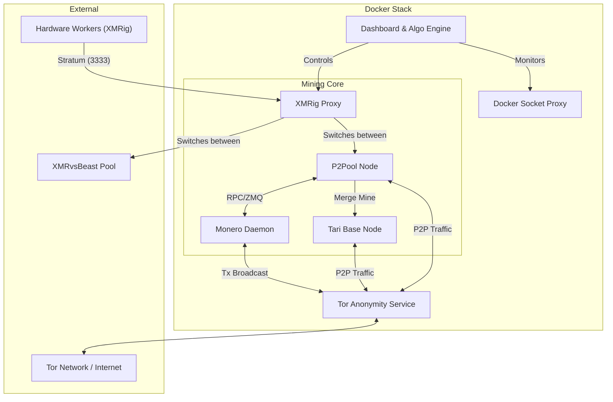

<div align="center">


# P2Pool Starter Stack

### Private Monero + Tari merge mining, the whole stack, in one command.

[](https://github.com/p2pool-starter-stack/p2pool-starter-stack/actions/workflows/ci.yml)
[](./LICENSE)


A professional-grade, containerized stack for running a private [Monero](https://www.getmonero.org/)
full node, [P2Pool](https://github.com/SChernykh/p2pool), and [Tari](https://www.tari.com/) merge
mining — engineered for **privacy**, **performance**, and **a setup you can finish before your
coffee gets cold**.


</div>

---

## ✨ Why this stack?

- 🧅 **Private by default.** A built-in Tor daemon gives Monero, Tari, and P2Pool hidden-service
  (onion) addresses. No public port forwarding, no exposing your home IP.
- ⛏️ **Monero + Tari, merge-mined.** Earn on both chains at once — Tari is mined alongside Monero
  through P2Pool with zero extra effort.
- 🧠 **Smart yield optimization.** An algorithmic engine continuously splits your hashrate between
  P2Pool and XMRvsBeast bonus rounds to maximize your return — automatically.
- 🔌 **One endpoint for every rig.** All your workers point at a single address. The stack routes
  hashrate upstream; you never touch a worker config to change pools.
- 📊 **A dashboard that actually tells you things.** Live hashrate, sync progress, PPLNS window,
  per-worker stats, and your P2Pool/XvB split — served over HTTPS on your LAN.
- 🚀 **One-command setup.** An interactive script handles dependencies, config, Tor, and kernel
  tuning, then starts everything for you.
- 🔒 **Hardened out of the box.** Least-privilege containers, SHA256-verified binaries, pinned
  versions, localhost-only RPC, and a read-only Docker socket proxy.

---

## 🚀 Quick Start

> **Platform:** Ubuntu Server **24.04 LTS** is officially supported. You'll need your Monero and
> Tari payout addresses handy.

```bash
git clone https://github.com/p2pool-starter-stack/p2pool-starter-stack.git
cd p2pool-starter-stack
chmod +x stack.sh
./stack.sh setup
```

`setup` checks dependencies (and offers to install them on Ubuntu), asks for your wallet
addresses, provisions Tor, tunes the kernel for RandomX, and offers to start the stack. Then:

1. **Open the dashboard** at `https://<your-hostname>` (the script prints the exact URL).
2. **Let it sync.** On first boot the dashboard shows **Sync Mode** while your Monero and Tari
   nodes catch up to the network — it switches to the live view automatically once synced.
3. **Add a worker** by pointing any [XMRig](https://github.com/xmrig/xmrig) rig at
   `YOUR_STACK_IP:3333`. No wallet address needed in the worker config.

📖 **Full walkthrough:** [docs/getting-started.md](docs/getting-started.md)

> **Already have a synced Monero node?** Skip the wait by pointing the stack at your existing
> blockchain — see [Reusing an existing node](docs/configuration.md#reusing-an-existing-node).

---

## 📚 Documentation

| Guide | What's inside |
|---|---|
| **[Getting Started](docs/getting-started.md)** | Prerequisites, install, first-run setup, and what to expect while the node syncs. |
| **[Configuration](docs/configuration.md)** | Every `config.json` key, applying changes safely, reusing an existing node, and remote Monero nodes. |
| **[The Dashboard](docs/dashboard.md)** | Sync Mode and a tour of the live operational view. |
| **[Adding Workers](docs/workers.md)** | Connect any rig, or use the high-performance worker provisioning kit. |
| **[Architecture](docs/architecture.md)** | The eight services, the privacy model, and the algorithmic XvB switching engine. |
| **[Operations & Maintenance](docs/operations.md)** | Full command reference, upgrades, backups, and troubleshooting. |

Browse the full index at **[docs/](docs/README.md)**.

---

## 🏗️ How it works

The stack orchestrates eight services via Docker Compose: a Monero **full node**, **P2Pool**, a
**Tari** base node, an **XMRig proxy** (your single worker endpoint), **Tor** for anonymity, the
**dashboard** + switching engine, a read-only **Docker socket proxy**, and **Caddy** for HTTPS.



Read the full breakdown — including the privacy model and the algorithmic switching engine — in
**[Architecture](docs/architecture.md)**.

---

## 🛠️ Common commands

Everything runs through `stack.sh` (`./stack.sh help` lists it all):

| Command | Description |
|---|---|
| `./stack.sh setup` | First-time interactive setup. |
| `./stack.sh apply` | Preview and apply `config.json` changes. |
| `./stack.sh up` / `down` / `restart` | Start / stop / restart the stack. |
| `./stack.sh upgrade` | Rebuild and restart after a `git pull`. |
| `./stack.sh logs [service]` | Follow logs (all, or one service). |
| `./stack.sh status` | Show container status. |

Full reference: **[Operations & Maintenance](docs/operations.md)**.

---

## 🤝 Donate

If this stack saved you time and you'd like to support it, donations to this XMR wallet are
appreciated:

```
89VGXHYEYdTJ4qQPoSZSD4BQsXCm6vCjUF2y2Vm42mA8ESLXA4XpmsvWMFB2stQw7p5UXnyZ81EMtgkCYqjYBPow8v7btKv
```

## 📄 License

Provided "as-is" under the [MIT License](./LICENSE).
