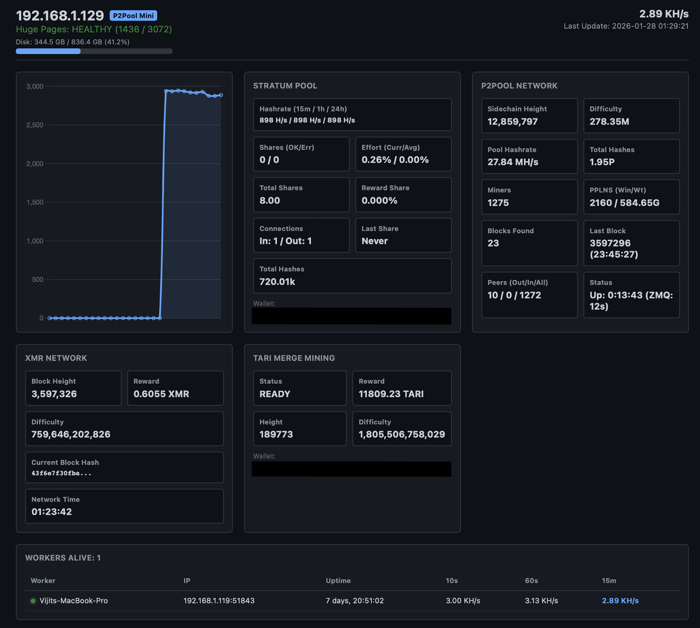
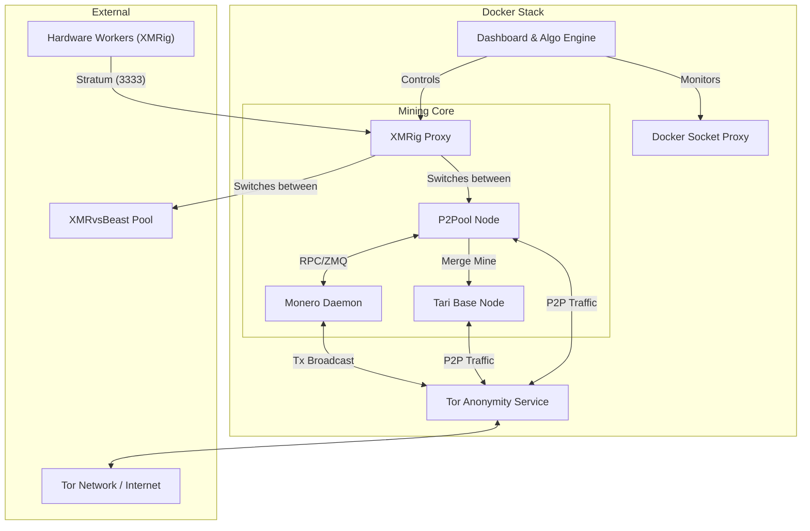

# P2Pool Starter Stack: Monero & Tari Merge Mining



A professional-grade, containerized infrastructure for running a private [Monero](https://www.getmonero.org/) full node, [P2Pool](https://github.com/SChernykh/p2pool), and [Tari](https://www.tari.com/) merge mining. This stack is engineered for maximum privacy ([Tor](https://www.torproject.org/)-only networking), hardware efficiency (HugePages/RandomX optimization), and ease of management via an interactive deployment script and bespoke dashboard.

## 🌟 Features
*   **Privacy by Design:** Integrated Tor daemon provides hidden services (Onion addresses) for Monero, Tari, and P2Pool. No public IPv4 port forwarding required.
*   **Merge Mining:** Automatically mines Tari (Minotari) alongside Monero via P2Pool sidechain integration.
*   **Smart Yield Optimization:** An algorithmic switching engine optimizes hashrate allocation between P2Pool and XMRvsBeast bonus rounds to maximize your yield.
*   **Simplified Worker Configuration:** A single endpoint for all your workers. The stack intelligently routes hashrate upstream.
*   **Real-time Dashboard:** A custom web UI provides at-a-glance monitoring of your entire mining operation, including hashrate, PPLNS window, and worker status.
*   **Effortless Deployment:** An interactive script handles setup, configuration, and kernel optimizations, getting you started in minutes.
*   **Robust & Secure:** All services are containerized. Binaries are verified via SHA256 hashes during build, and services run with least-privilege users where applicable.

## 🏗️ Architecture
The stack orchestrates seven primary services via Docker Compose:
1.  **Monerod:** The Monero daemon (Full Node). Configured for restricted RPC and Tor transaction broadcasting.
2.  **P2Pool:** The decentralized mining sidechain, with support for Main, Mini, and Nano pools.
3.  **Tari Base Node:** The Minotari node for merge mining with Monero.
4.  **XMRig Proxy:** A central connection point for all your mining hardware.
5.  **Tor:** A centralized anonymity layer providing SOCKS5 proxies and Hidden Services for all containers.
6.  **Dashboard:** The web-based monitoring UI and algorithmic switching engine.
7.  **Docker Proxy:** A secure, read-only proxy for the Docker Socket, allowing the Dashboard to safely query container stats.

### High-Level Diagram



## 🧠 Algorithmic Switching
This stack employs a smart switching strategy to maximize yield. Instead of requiring complex worker configurations, it manages hashrate distribution centrally.

### Worker Configuration
Your workers connect to a **single endpoint**: the `xmrig-proxy` service on port `3333`.

### Decision Engine
The Dashboard service contains the decision engine. It constantly monitors your total hashrate and the XMRvsBeast pool's status:
1.  **Tier Calculation:** It determines the highest XMRvsBeast donation tier you qualify for.
2.  **Dynamic Proxy Reconfiguration:** Based on your current yield and the needs of the donation tier, the engine automatically reconfigures the `xmrig-proxy` to send hashrate to either **P2Pool** (for Monero + Tari mining) or **XMRvsBeast** (for bonus rewards). This happens seamlessly without any changes needed on your workers.

## 🚀 Getting Started

### 1. Prerequisites
*   **OS:** Ubuntu 24.04 LTS (Recommended) or macOS.
*   **Hardware:** A CPU with AVX2 support is highly recommended for RandomX performance.
*   **Software:** Docker Engine & Docker Compose V2.
*   **Utilities:** `jq` and `openssl` must be installed.
    ```bash
    # On Ubuntu/Debian
    sudo apt update && sudo apt install -y jq docker.io docker-compose-v2 openssl
    ```

### 2. Deployment
The `p2pool-starter-stack.sh` script is your single point of entry for managing the stack.

1.  **Run the script:**
    ```bash
    chmod +x p2pool-starter-stack.sh
    ./p2pool-starter-stack.sh
    ```
2.  **Interactive Setup:** If this is your first time running the script, it will prompt you for your Monero and Tari wallet addresses and a username/password for your Monero node. It will then generate a `config.json` file for you.
3.  **Kernel Optimization (Linux Only):** The script will configure HugePages for optimal mining performance. A **reboot is required** for these changes to take effect.
4.  **Start the stack:** After the initial setup (and reboot if required), the script will ask if you want to start the stack.

## ⛏️ Adding Workers
Connect your XMRig workers to the IP address of the machine running the stack on port `3333`.

The wallet address is managed by the P2Pool service on the main stack; **you do not need to put your wallet address in your worker's configuration.**

When configuring your worker's `config.json`, the `user` field should be a unique name to identify the worker on the dashboard. If you use the provided worker script, it will default to the machine's hostname.

**Example `config.json` for a manually configured worker:**
```json
{
    "pools": [
        {
            "url": "YOUR_STACK_IP:3333",
            "user": "my-rig-01"
        }
    ]
}
```
For a fully automated and optimized worker setup, see the **High-Performance Worker Provisioning Kit** in the `worker/` directory.

## 📈 Monitoring
Access the dashboard in your web browser:
*   `http://<your-server-ip>:8000` (or `http://localhost:8000`)

The script will print the exact URL when you start the stack.

## 🛠️ Maintenance
Use the `p2pool-starter-stack.sh` script to manage your stack.

| Command | Description |
|---|---|
| `./p2pool-starter-stack.sh -s` | Start the stack. |
| `./p2pool-starter-stack.sh -d` | Stop the stack. |
| `./p2pool-starter-stack.sh -r` | Restart the stack. |
| `./p2pool-starter-stack.sh -l` | View the logs of all containers. |
| `./p2pool-starter-stack.sh -st`| Check the status of the containers. |
| `./p2pool-starter-stack.sh -rd`| **DESTRUCTIVE!** Wipes and refreshes the Dashboard and P2Pool data. |

**To update the stack:**
Modify the `ARG` versions in the Dockerfiles, or tari version in `docker-compose.yml`, and rebuild:
```bash
docker compose up -d --build
```


## 🤝 Donation If you found this useful and would like to donate, please donate to this XMR wallet:
```bash
89VGXHYEYdTJ4qQPoSZSD4BQsXCm6vCjUF2y2Vm42mA8ESLXA4XpmsvWMFB2stQw7p5UXnyZ81EMtgkCYqjYBPow8v7btKv
```

## 📄 License
This project is provided "as-is" under the MIT License.