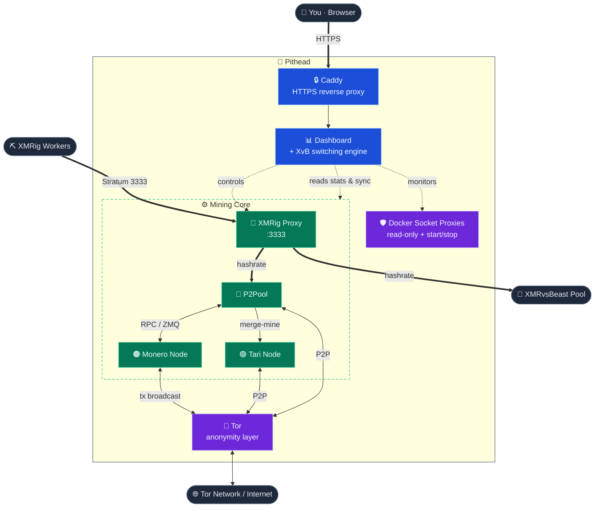

# Architecture

The stack orchestrates nine containerized services via Docker Compose. Together they give you a
private Monero full node, decentralized P2Pool mining, Tari merge mining, a single worker
endpoint, and a monitoring dashboard — all behind Tor, with no public port forwarding required.

## The services

| # | Service | Role |
|---|---|---|
| 1 | **Monerod** | The Monero daemon (full node). Configured for restricted RPC and Tor transaction broadcasting. |
| 2 | **P2Pool** | The decentralized mining sidechain, with support for Main, Mini, and Nano pools. |
| 3 | **Tari Base Node** | The Minotari node, merge-mined alongside Monero. |
| 4 | **XMRig Proxy** | A single connection point for all your mining hardware; the switching engine reconfigures it on the fly. |
| 5 | **Tor** | A centralized anonymity layer providing SOCKS5 proxies and hidden services (onion addresses) for the other containers. |
| 6 | **Dashboard** | The web monitoring UI and the algorithmic switching engine. |
| 7 | **Docker Proxy** | A **read-only** proxy onto the Docker socket so the dashboard can read container stats/logs — no write access. |
| 8 | **Docker Control** | A second, minimal socket proxy scoped to **only** `start`/`stop` (nothing else — not create/kill/exec/reads), so the dashboard can reject workers when a node is down (Issue #31), hold p2pool + xmrig-proxy until the chains finish syncing (Issue #35), and switch a clearnet-syncing node back to Tor once it's synced (Issue #234). Kept separate so its write grant can't widen the read-only proxy. |
| 9 | **Caddy** | A reverse proxy that serves the dashboard over HTTPS (automatic local TLS) on the LAN. |

## High-level diagram

**Reading the diagram:** **thick arrows** carry mining hashrate and inbound connections, **dotted
arrows** are the dashboard's control and monitoring, and **solid arrows** are internal service
data and anonymized network traffic. Node colors group services by role — 🟦 control plane
(Caddy, Dashboard), 🟪 privacy & isolation (Tor, Docker socket proxy), and 🟩 the mining core.
In remote-node mode the bundled 🟠 Monero node isn't started, and P2Pool talks to your external
node instead.

## Privacy by design

Privacy is a primary design goal, not an afterthought — the stack is **Tor-first**. A dedicated Tor
daemon provides hidden services (onion addresses) for Monero, Tari, and P2Pool, so **inbound**
connectivity needs **no public IPv4 port forwarding**. Monero and Tari route their P2P and
transaction traffic over Tor, and the clearnet DNS lookups those nodes used to leak are closed
(monerod checkpoints/blocklist/update-check, Tari DNS seeds + Pulse). The node's RPC is bound to
localhost by default (opt into LAN access explicitly via `monero.rpc_lan_access`).

It is **Tor-first.** Two *outbound* yield paths used clearnet in v1.0 and could **reveal your home IP**
— P2Pool's outbound sidechain peers and XvB donation mining — but **as of v1.1 both are Tor-by-default**,
each with a documented opt-out for operators who'd trade privacy for yield (measured at ~10 % of yield
on `mini`; see the [Tor-vs-clearnet benchmark](benchmarks/tor-vs-clearnet.md)). Install and image pulls
still reveal your IP once. See **[Privacy & network egress](privacy.md)** for the complete
connection-by-connection map and how to lock down the rest.

## Security posture

- **Containerized, non-root & least-privilege.** Services run in containers, and every one runs
  its main process as a **non-root user** (not uid 0) — pithead owns the data directories and
  chowns each bind-mount to the uid its container uses, so a breakout or RCE in any daemon lands
  as an unprivileged user. Where a privilege is genuinely needed (e.g. P2Pool's memory locking)
  it's granted narrowly — P2Pool relies on an unlimited `memlock` ulimit rather than running
  privileged. The leaf services (Caddy, the dashboard, the two Docker socket proxies, and
  `xmrig-proxy`) run with `no-new-privileges`, and all of them **drop every Linux capability**
  (`cap_drop: [ALL]`) — Caddy keeps only `NET_BIND_SERVICE` so it can bind `:80`/`:443`. The
  dashboard now writes its history database as that non-root user into its (matching-owned) volume,
  so it no longer needs root's file-permission capability and drops all caps like the others.
  Caddy and both socket proxies additionally run with a **read-only root filesystem**, writing only
  to a small ephemeral `tmpfs` and (for Caddy) the `caddy_data` volume that holds its certs.
- **Mining endpoint stays on the LAN.** The stratum port (`3333`) your rigs connect to is meant
  for your local network, never the public internet. It's published on all interfaces by default
  so LAN rigs work out of the box; narrow it with `p2pool.stratum_bind` (a specific LAN IP, or
  `127.0.0.1`) and firewall it to your LAN. See [Connecting Miners › Firewall](workers.md#firewall).
- **Verified binaries.** Third-party binaries are SHA256-verified during the image build.
- **Pinned versions.** Service images and binaries are pinned to known-good versions.
- **Hardened dashboard.** Security headers (a restrictive `Content-Security-Policy`,
  `X-Frame-Options: DENY`, `nosniff`, `Referrer-Policy`) and a sanitized error handler; it reaches
  Docker only through socket proxies, never the raw socket: a **read-only** one for stats/logs, and
  a separate **control** proxy scoped to `start`/`stop` only (its ruleset denies create/kill/exec
  and all reads). Splitting them means the write grant needed for node-down worker failover can't
  widen the read-only proxy's access. General Docker write access stays off.
- **Locked-down config.** `config.json` is created `chmod 600` (owner-only), and the internal RPC
  proxy token is generated once and preserved across re-runs.

---

## Algorithmic switching

**Set it once and the stack plays the XvB raffle for you — no per-rig pool juggling, ever.** Rather
than asking you to configure each rig for a different pool, it manages hashrate distribution
**centrally**: all your workers connect to a single endpoint — the `xmrig-proxy` service on port
`3333` — and the dashboard's decision engine continuously reallocates that hashrate between
**P2Pool** (your own zero-fee Monero + Tari payouts) and **XMRvsBeast (XvB)** bonus rounds. It
donates only the **minimum** needed to hold your target tier and hands every spare cycle back to
P2Pool — maximizing yield with no manual tuning and no over-donating.

### How the engine decides

1. **Tier targeting.** The engine picks which XvB donation tier to aim for, set by
   `xvb.donation_level`:
   - `auto` (default) — the highest tier your current hashrate can sustain.
   - a specific tier — `donor`, `vip`, `whale`, or `mega`. A specific tier is honored **even if
     your hashrate is too low to hold it**, in which case the dashboard shows a
     **⚠ Hashrate low for tier** badge.

   The four tiers and the donation hashrate each requires — which you must sustain on **both** your
   1-hour **and** 24-hour donation averages (as measured by XMRvsBeast) — are set by the XvB raffle:

   | Tier | Donation hashrate to hold it |
   |---|---|
   | `donor` | **1 kH/s** (1,000 H/s) |
   | `vip` | **10 kH/s** (10,000 H/s) |
   | `whale` | **100 kH/s** (100,000 H/s) |
   | `mega` | **1 MH/s** (1,000,000 H/s) |

   > **Heads-up on the name "VIP".** The `vip` *tier* above is a **donation level** (10 kH/s) — don't
   > confuse it with the dashboard's **Raffle Eligible** box. That box turns green only when you're set
   > up to actually win *and* collect a payout: donating at least the **donor** tier (on credited 1h+24h,
   > the same threshold tracked by **Current Tier**) **and** holding a P2Pool PPLNS share. XvB's bare
   > rule calls just-having-a-share a "VIP"; the dashboard is stricter, so a green "Yes" means a win is
   > actually paid — see the [Dashboard](dashboard.md) guide.

   Because the XvB raffle picks winners at random, donating *above* a tier's threshold earns
   nothing extra — so the engine donates only enough to hold the target tier and routes the rest
   to P2Pool.

2. **Dynamic proxy reconfiguration.** A feedback controller watches your measured **1h / 24h
   donation averages** and reconfigures the `xmrig-proxy` to send just enough time to XvB to stay
   in tier — ramping donation up when you fall behind and easing off as you catch up — with the
   remainder going to P2Pool. This happens seamlessly, with **no changes on your workers**.

The result: you stay in your chosen XvB tier with minimal donation, and every spare cycle mines
Monero + Tari on P2Pool. The dashboard's hashrate chart shades the P2Pool/XvB split over time so
you can watch the controller work.

---

## See also

- [The Dashboard](dashboard.md) — Sync Mode and the live operational view.
- [Configuration](configuration.md) — the `xvb.*` settings, data directories, and remote nodes.
- [Connecting Miners](workers.md) — connecting hardware to the single `3333` endpoint.
