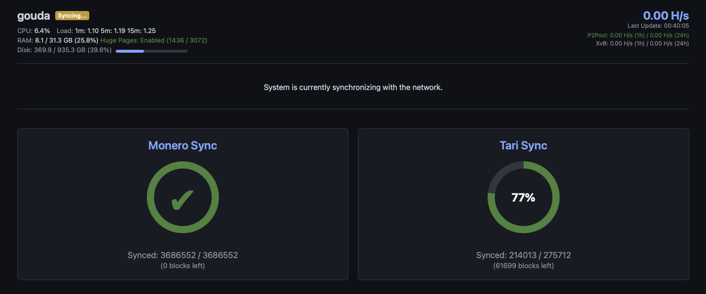
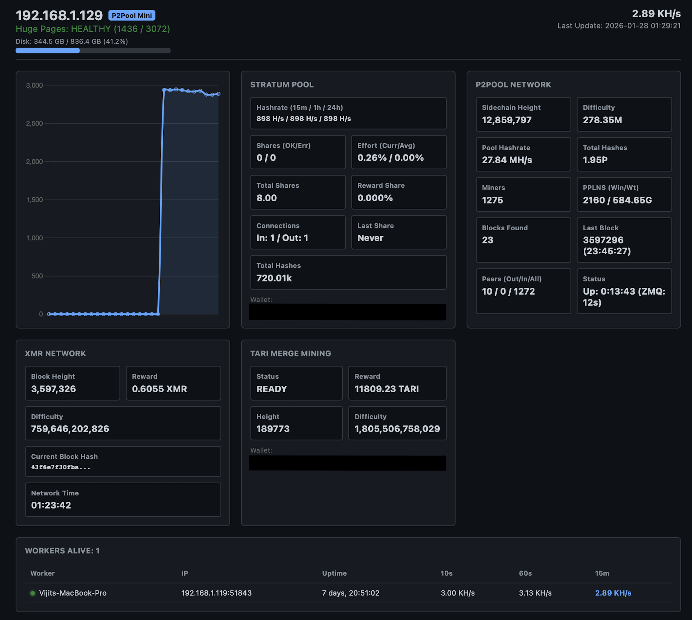

# The Dashboard

The dashboard is the control center for your stack: a single web page that monitors every
service, charts your hashrate, and surfaces the decisions made by the algorithmic XvB switching
engine. It's served over HTTPS by Caddy at `https://<your-hostname>` (the URL is printed when the
stack starts).

The dashboard has **two states**. While your nodes are catching up to the network it shows
**Sync Mode**; once both chains are synced it switches automatically to the full **operational
view**.

---

## Sync Mode

The first time you start the stack — or any time the Monero or Tari node is still catching up to
the network — the dashboard shows **Sync Mode**. A **`Syncing…`** badge appears next to the
hostname, the headline reads *"System is currently synchronizing with the network,"* and no
hashrate is routed yet.



Sync Mode gives each chain its own progress card so you can see exactly where things stand:

- **Monero Sync** — current verified block height vs. the network tip, with the number of blocks
  remaining. A green check means this chain is fully caught up. It also shows whether the node is
  running **Pruned** or **Full** and its on-disk DB size (also in the **XMR Network** panel of the
  operational view) — handy for confirming a reused chain matches your `monero.prune` setting.
- **Tari Sync** — the same, as a percentage ring, for the Minotari chain.

The top bar still shows live host telemetry throughout — CPU, load average, RAM, **HugePages**
(so you can confirm RandomX optimization is active), and disk usage — which is handy for keeping
an eye on resources during the initial download.

**Why this screen exists:** a Monero or Tari node can't mine until it has downloaded and verified
the blockchain, which on a first run can take from a few hours to over a day depending on your
hardware, disk, and network. Sync Mode makes that progress visible instead of leaving you
guessing. Once the required chains report fully synced, the dashboard automatically swaps Sync
Mode for the operational view and mining begins — no refresh or restart needed.

While the chains are syncing, the dashboard keeps `p2pool` and `xmrig-proxy` **stopped** (a
**`Miner held (sync)`** badge shows next to the hostname) and starts them automatically once
they're ready. Running p2pool against an unsynced node achieves nothing and floods Tari's logs
with merge-mining chatter that buries the messages you'd actually want while debugging a sync.
Releasing the miner is one-way — once it starts it stays up. By default the stack waits for
**both** Monero and Tari; if you've set [`dashboard.tari_required: false`](configuration.md), it
waits only for Monero and starts mining while Tari finishes syncing in the background.

> **Want to skip most of the wait?** Point the stack at an existing synced blockchain, or connect
> to a remote node. See [Configuration › Reusing an existing node](configuration.md#reusing-an-existing-node).

You can also follow sync progress from the command line:

```bash
./pithead logs monerod
./pithead logs tari
```

---

## The operational view

Once both nodes are synced, the dashboard shows the full operational view.



The page updates itself **live** every 30 seconds, refreshing each panel in place rather than
reloading the whole page — so your scroll position, the column you've sorted the worker table by,
and the chart all stay put between updates.

### Top bar

A persistent status strip across the top shows the hostname, host telemetry (CPU, load, RAM,
HugePages, disk), your **total hashrate**, and headline **1h / 24h averages** for both P2Pool and
XvB so you can see your split at a glance. Next to the disk readout, an **`XMR Pruned`** /
**`XMR Full`** badge shows the Monero node's blockchain mode at a glance.

When the dashboard host is a name (not already an IP), the machine's **IP address** is shown
beside it as `hostname @ ip` (e.g. `pithead.local @ 192.168.1.42`) — a reliable way back in when
the hostname doesn't resolve from your phone or another machine on the LAN.

A small **version badge** sits beside the hostname so you always know which build is running. A
released build shows the version (e.g. **`v1.3.0`**); a development or working-tree build shows a
dashed **`dev · branch @ commit`** marker instead, so it's never mistaken for a release. It appears
on every screen — including Sync Mode — which makes it easy to confirm what you're on when sharing a
screenshot in a bug report.

### Node status & failover

If a local node becomes unreachable, a red **`monerod DOWN`** or **`Tari DOWN`** badge appears in
the top bar (after a short debounce, so a momentary blip doesn't flap). Sync state is read from
monerod's `get_info` RPC and Tari's gRPC, so "down" means the node itself is unreachable — not just
that a log line changed.

A red **`⚠ DB write failing`** badge appears if the dashboard can't write to its own SQLite database
(a full or read-only disk, a permissions problem). The dashboard keeps serving live data, but
hashrate history, shares, and stats won't survive a restart until it's fixed — so it's surfaced
rather than lost silently.

While a node is down, the dashboard also **rejects workers** so they fail over to the backup pools
you've configured, instead of sitting idle on a stack that can't mine for them — a sustained outage
stops the `xmrig-proxy` container (a **`Workers rejected`** badge shows) and a confirmed recovery
restarts it. monerod is required to mine, so a monerod outage always rejects. Tari is merge-mining
gravy, so whether a Tari outage rejects follows [`dashboard.tari_required`](configuration.md): when
it's `true` (default) a Tari outage rejects too; set it `false` to keep mining Monero straight
through a Tari outage. (Rejection never triggers for a remote monerod — the stack doesn't manage
that node.)

**Non-blocking Tari.** With `tari_required: false`, a Tari-only (re)sync no longer takes over the
screen: the operational view stays up, mining continues, and a **`Tari syncing`** badge shows Tari's
progress until it catches up and merge mining resumes.

### Hashrate chart

A time-series chart of your hashrate with selectable ranges (1h / 24h / 1w / 1mo) that switch
instantly without reloading the page. The shaded bands show how hashrate was split between
**P2Pool** and **XvB** over time, so you can see the switching engine at work.

### Overview

The summary panel pulls the key numbers together:

| Field | Meaning |
|---|---|
| **Mining Mode** | What the stack is routing hashrate to right now (e.g. P2Pool, XvB, or a split). |
| **Total Hashrate** | Your combined hashrate across all workers. |
| **Share in Window** | Your shares in the current P2Pool PPLNS window. |
| **Last Share** | Time since your last accepted share. |
| **P2Pool 1h / 24h avg** | Time-weighted average hashrate routed to P2Pool. |
| **XvB 1h / 24h avg** | Donation hashrate credited by the XMRvsBeast API (the definitive record). |
| **Current Tier** | The XvB tier you're currently holding. |
| **Target Tier** | The tier the engine is aiming for (from `xvb.donation_level`). If your hashrate can't sustain an explicitly chosen tier, a **⚠ Hashrate low for tier** badge appears. |
| **Tari Mining** | Whether merge mining of Tari is active and healthy. |
| **Wallets** | Your configured Monero and Tari payout addresses. |

### Workers Alive

A live table of every connected rig — worker name, IP, uptime, and per-worker hashrate over
several windows (e.g. 10s / 60s / 15m) — so you can spot a rig that has dropped off or is
underperforming. A worker that's connected but whose direct API is unreachable still counts (with
proxy-derived hashrate); a worker whose miner has stopped drops out of the total. On a narrow
screen the table scrolls sideways within its card, so its columns stay readable rather than
stretching the page.

Each rig also shows its **accepted** and **rejected** share counts (with invalid shares folded
into the rejected column as `3 (+2 inv)` when present). A rig whose reject rate climbs past ~5%
gets a red **⚠** flag next to its rejected count — a quick way to catch a rig that's submitting
stale or bad shares (bad overclock, flaky network, clock drift) rather than earning. Every column
is sortable, so you can click **Rejected** to float the worst offenders to the top. The shares are
cumulative since the proxy last started, so a brief early-run blip clears itself as good shares
accumulate.

Below the table, a **Proxy totals** line sums the whole stack's share health as reported by the
xmrig-proxy: total accepted / rejected (with the aggregate reject %) / invalid shares submitted
upstream, plus the **best difficulty** any of your shares has hit. It's hidden until the proxy has
submitted its first shares.

### Simple vs. Advanced view

A **Simple / Advanced** toggle sits above the chart. **Simple** (the default) keeps the page to
the essentials — the chart, the Overview summary, and the worker table. **Advanced** swaps the
Overview for a set of power-user cards that break out the same data in more detail: **My P2Pool
Node Stats**, **Global P2Pool Stats**, **XvB Donation Stats**, **XMR Network**, **Tari Merge
Mining**, and the **P2Pool Earnings (estimated)** calculator below. Your choice is remembered
across reloads.

### P2Pool Earnings (estimated)

A **P2Pool** mining calculator (Advanced view): it estimates the **XMR earned from P2Pool mining
only**, turning your P2Pool hashrate and the live Monero network figures into a rough payout
estimate. It is deliberately scoped to P2Pool — it is **not** an XvB or a Tari calculator:

- **XvB donations are excluded.** Hashrate you route to XvB earns no P2Pool payout, so it isn't
  counted. The default is your **P2Pool 1h-average hashrate** — the *same* `P2Pool (1h)` figure
  shown in the header and the Overview / My Node cards — which already excludes any XvB-donated
  slice. So if you're running an **XvB split**, the estimate reflects your real P2Pool earnings,
  not an inflated total, and it stays consistent with the hashrate shown elsewhere on the page.
  (When that average is 0 — a fresh start with no history yet, or donating everything to XvB —
  the estimate is 0 until you enter a what-if value.)
- **Tari merge-mining is excluded.** Tari is earned alongside Monero but is a separate payout
  (its own calculator is planned).

| Field | Meaning |
|---|---|
| **Your P2Pool Hashrate** | The hashrate the estimate is based on. Defaults to your **P2Pool 1h average** (the same figure the header shows, excluding any XvB-donated portion); type a different value (e.g. `50k`, `1.2 MH/s`) to see a **what-if** projection if you added or removed P2Pool hashpower. |
| **XMR / day · month · year** | Expected Monero earned over each horizon, computed as `hashrate × block reward ÷ network difficulty` — the standard variance-free mining expectation. P2Pool's zero-fee PPLNS payout makes this the right long-run expectation. |
| **Time / Share** | How long, on average, that hashrate takes to find one P2Pool (sidechain) share. |
| **XMR Block Reward** | The current Monero block reward, for context. |

> **These are estimates, not guarantees.** Mining is variance-heavy, so real payouts swing well
> above and below these figures — the calculator says so in a disclaimer on the card. If the
> network figures aren't available yet, the card shows `—` rather than a bogus number. **Tari**
> earnings and an **XvB tier** projection aren't included yet.

---

## Tips

- **First visit certificate warning.** With `dashboard.secure: true` (the default), Caddy uses a
  self-signed certificate, so your browser shows a one-time "connection is not private" warning.
  Accept it to proceed. To use plain HTTP instead, set `dashboard.secure: false` and run
  `./pithead apply`.
- **Reaching it from another machine.** Use the hostname/IP of the stack server. If your hostname
  doesn't resolve on your LAN, set `dashboard.host` in `config.json` to an address that does.
- **Adding a login.** By default the dashboard has no password — fine for a private LAN appliance.
  If the box is shared or reachable beyond your LAN, set `dashboard.auth.password` (keep
  `dashboard.secure: true`) and run `./pithead apply` to put a login prompt in front of it. See
  [Configuration › Exposing the dashboard safely](configuration.md#exposing-the-dashboard-safely).
- **On your phone.** The dashboard is responsive — open the same URL on a phone and the layout
  reflows to a single column with a stacked header, so you can check on the stack from the couch.
- **Stuck on Sync Mode?** That usually just means the chain is still downloading. Check
  `./pithead logs monerod` / `./pithead logs tari` for steady progress; see
  [Operations › Troubleshooting](operations.md#troubleshooting) if a node looks stalled.

For how the switching engine decides the P2Pool/XvB split, see
[Architecture › Algorithmic switching](architecture.md#algorithmic-switching).
