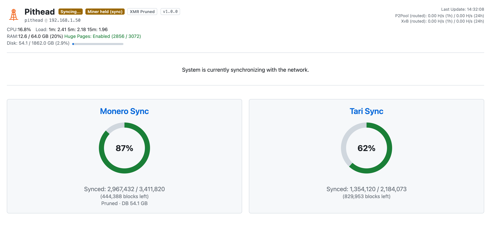
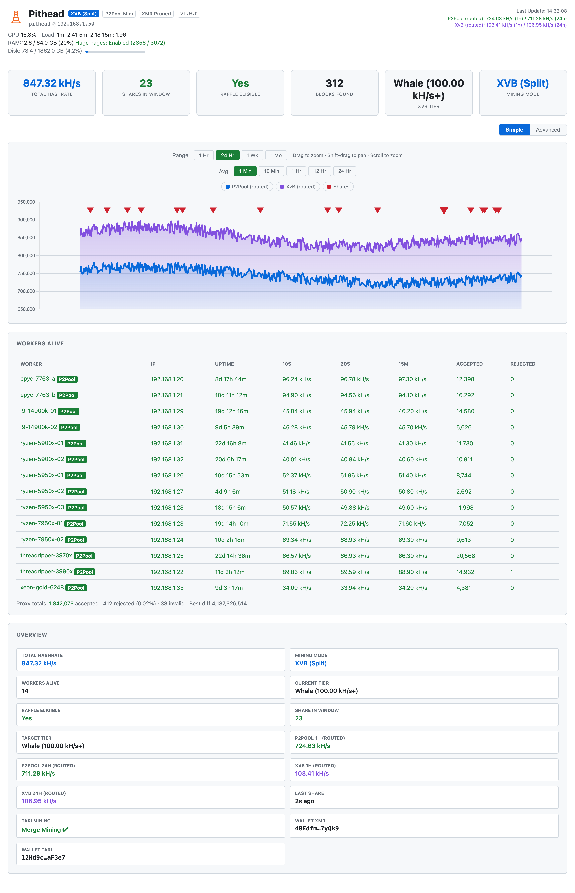
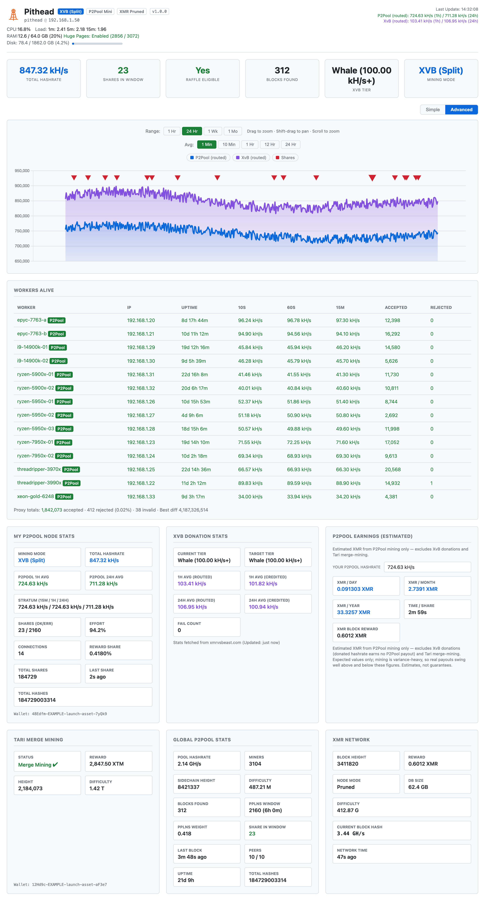

# The Dashboard

A single web page that monitors every service, charts hashrate, and shows the XvB switching engine's
decisions. Caddy serves it over HTTPS at `https://<hostname>` (the URL is printed when the stack
starts); with `dashboard.secure: false` it serves plain HTTP.

The dashboard has two states. While the nodes catch up to the network it shows Sync Mode. Once both
chains are synced it switches to the operational view.

---

## Sync Mode

The dashboard shows Sync Mode the first time you start the stack, or any time the Monero or Tari
node is still catching up. A `Syncing...` badge appears next to the hostname, the headline reads
*"System is currently synchronizing with the network,"* and no hashrate is routed yet.

<picture>
  <source media="(prefers-color-scheme: dark)" srcset="../images/launch/sync.png">
  
</picture>

Sync Mode gives each chain its own progress card:

- **Monero Sync**: verified block height vs. the network tip, with blocks remaining. A green check
  means the chain is caught up. It also shows Pruned or Full mode and the on-disk DB size (also in
  the **XMR Network** panel of the operational view), so you can confirm a reused chain matches your
  `monero.prune` setting.
- **Tari Sync**: the same, as a percentage ring, for the Minotari chain.

The top bar shows live host telemetry throughout: CPU, load average, RAM, HugePages (to confirm
RandomX optimization is active), and disk usage, for watching resources during the initial download.

A Monero or Tari node cannot mine until it has downloaded and verified the blockchain. On a first
run that takes a few hours to over a day, depending on hardware, disk, and network. Once the required
chains report synced, the dashboard swaps Sync Mode for the operational view and mining begins — no
refresh or restart needed.

While the chains sync, the dashboard keeps `p2pool` and `xmrig-proxy` stopped (a `Miner held (sync)`
badge shows next to the hostname) and starts them once the chains are ready. Running p2pool against
an unsynced node does nothing and floods Tari's logs with merge-mining chatter. Releasing the miner
is one-way: once it starts it stays up. By default the stack waits for both Monero and Tari. With
[`dashboard.tari_required: false`](configuration.md) it waits only for Monero and mines while Tari
finishes syncing in the background.

> **Want to skip most of the wait?** Point the stack at an existing synced blockchain, or connect
> to a remote node. See [Configuration › Reusing an existing node](configuration.md#reusing-an-existing-node).

You can also follow sync progress from the command line:

```bash
./pithead logs monerod
./pithead logs tari
```

---

## The operational view

Once both nodes are synced, the dashboard shows the operational view.

<picture>
  <source media="(prefers-color-scheme: dark)" srcset="../images/launch/simple.png">
  
</picture>

The page updates every 30 seconds, refreshing each panel in place rather than reloading. Scroll
position, the worker-table sort column, and the chart stay put between updates.

### Top bar

A status strip across the top shows the hostname, host telemetry (CPU, load, RAM, HugePages, disk),
total hashrate, and 1h / 24h routed averages for both P2Pool and XvB (your split). Next to the disk
readout, an `XMR Pruned` / `XMR Full` badge shows the Monero node's blockchain mode.

When the dashboard host is a name (not already an IP), the machine's IP shows beside it as
`hostname @ ip` (e.g. `pithead.local @ 192.168.1.42`), a way back in when the hostname doesn't
resolve from a phone or another LAN machine.

A version badge sits beside the hostname. A released build shows the version (e.g. `v1.3.0`); a
development or working-tree build shows a dashed `dev · branch @ commit` marker instead, so it is not
mistaken for a release. It appears on every screen, including Sync Mode, so a screenshot in a bug
report shows the build. To switch a `dev` build to a published release, see
[Switching a source checkout to release images](operations.md#switching-a-source-checkout-to-release-images).

When a newer Pithead release is out, a clickable `New release vX.Y.Z available ↗` badge appears next
to the version badge, linking to the GitHub release. It never updates anything; upgrade with
`./pithead upgrade` when ready. The check is on by default and routed over Tor, so it does not reveal
your IP. Turn it off with `dashboard.check_for_updates: false` (see
[Configuration](configuration.md#configuration-reference)).

### Host & performance warnings

The top bar also surfaces the persistent host conditions that `setup` warns about, derived from
**live** metrics so they self-correct rather than going stale:

| Badge | Means | Fix |
|---|---|---|
| `⚠ HugePages off` | HugePages aren't reserved — RandomX hashrate is capped. | Run setup's tuning (or edit GRUB) and reboot; the badge clears once they're reserved. |
| `⚠ Low RAM (N GB)` | Under 16 GB of RAM — syncing is memory-heavy and Tari can OOM. | Add RAM for a stable node. |
| `⚠ No AVX2` | The CPU lacks AVX2, so RandomX mining is much slower. | A hardware limit; nothing to change at runtime. |

The first two also push a Telegram alert (`hugepages`, `low_ram`) when first detected, if the bot is
on; AVX2 is badge-only (see [Telegram Bot](telegram.md#choosing-which-alerts-you-get)). All active
warning badges are echoed in the bot's `/status` reply.

### Hero band

A strip of headline KPIs sits below the top bar:

| KPI | Meaning |
|---|---|
| **Total Hashrate** | Your combined hashrate across all workers. |
| **Shares in Window** | Shares you currently hold in the P2Pool PPLNS window (green when above zero). |
| **Raffle Eligible** | Whether you'd actually win **and** collect an XvB raffle payout: green **Yes**, red **No**, or muted **N/A** when XvB is off. (Full definition in [Overview](#overview).) |
| **Blocks Found** | P2Pool sidechain blocks your node has found. |
| **XvB Tier** | The donation tier you're currently holding. |
| **Mining Mode** | What your hashrate is routed to right now: P2Pool, XvB, or a split. |

### Node status & failover

If a local node becomes unreachable, a red `monerod DOWN` or `Tari DOWN` badge appears in the top
bar (after a short debounce, so a momentary blip doesn't flap). Sync state is read from monerod's
`get_info` RPC and Tari's gRPC, so "down" means the node itself is unreachable, not just that a log
line changed.

A red `⚠ DB write failing` badge appears if the dashboard can't write to its SQLite database (full
or read-only disk, permissions problem). The dashboard keeps serving live data, but hashrate history,
shares, and stats won't survive a restart until it's fixed.

While a node is down, the dashboard rejects workers so they fail over to the backup pools you've
configured, rather than sitting idle on a stack that can't mine. A sustained outage stops the
`xmrig-proxy` container (a `Workers rejected` badge shows) and a confirmed recovery restarts it.
monerod is required to mine, so a monerod outage always rejects. Whether a Tari outage rejects
follows [`dashboard.tari_required`](configuration.md): `true` (default) rejects on a Tari outage;
`false` keeps mining Monero through it. Rejection never triggers for a remote monerod, since the
stack doesn't manage that node.

**Non-blocking Tari.** With `tari_required: false`, a Tari-only (re)sync doesn't take over the
screen: the operational view stays up, mining continues, and a `Tari syncing` badge shows Tari's
progress until it catches up and merge-mining resumes.

### Hashrate chart

A time-series chart of hashrate with selectable ranges (1h / 24h / 1w / 1mo) that switch without
reloading. Shaded bands show the P2Pool/XvB split over time.

Diamond markers along the top flag **hashrate events** (#99): an amber one where total hashrate
dropped sharply and stayed down (an outage or a rig gone dark), a green one where it recovered.
Hover for the size of the drop. They mark the same transitions as the `hashrate_loss` Telegram
alert and survive a dashboard restart, so a drop that happened overnight is still on the chart in the
morning.

An **Avg** control picks the hashrate-averaging window the chart plots: `1 Min` / `10 Min` /
`1 Hr` / `12 Hr` / `24 Hr` (the native windows xmrig-proxy reports). It is independent of the Range
control: the range sets how much *time* the x-axis spans; the averaging window sets how *smooth* each
plotted point is. Short windows (1–10 min) react within a poll or two, so a rig dropping or joining
shows up fast. Long windows (12–24 h) ride out the noise to show the trend. The choice is remembered
across reloads. Two things to know:

- `10 Min` is the default and matches the dashboard's headline hashrate.
- The longer windows need that much rig uptime to fill. Right after a (re)start, `12 Hr`/`24 Hr` read
  low and climb until enough history exists. Per-window history is kept only *going forward* from the
  version that introduced this control, so those lines are flat at the far-left edge of a long range
  until new data accumulates. Expected, not a fault.

### Overview

The summary panel pulls the key numbers together:

| Field | Meaning |
|---|---|
| **Mining Mode** | What the stack is routing hashrate to right now (e.g. P2Pool, XvB, or a split). |
| **Total Hashrate** | Your combined hashrate across all workers. |
| **Workers Alive** | How many rigs are connected and online right now. |
| **Share in Window** | Your shares in the current P2Pool PPLNS window. |
| **Raffle Eligible** | **Yes** only when you're set up to both *win* and *collect* an XvB payout: you're donating at least the **donor tier** (1 kH/s on XvB's *credited* 1h **and** 24h averages, the same threshold as **Current Tier**) **and** you hold a P2Pool PPLNS share (XvB's "VIP" gate; without it a win is skipped and you take a fail). Reads **No** when donating but a gate is unmet, and **N/A (XvB off)** when XvB is disabled. Intentionally stricter than XvB's bare "VIP = just a share" so a green Yes means a win is paid. |
| **Last Share** | Time since your last accepted share. |
| **P2Pool 1h / 24h (routed)** | Time-weighted average hashrate the proxy actually routed to P2Pool. |
| **XvB 1h / 24h (routed)** | Time-weighted average hashrate the proxy actually **routed** to XvB. (The XvB-API *credited* figure, XvB's definitive record, appears in the **Advanced** view's *XvB Donation Stats* card.) |
| **Current Tier** | The XvB tier you're currently holding, the one cleared by the **lower of your credited 1h and 24h** donation averages, so a recent hashrate drop shows up right away. |
| **Target Tier** | The tier the engine is aiming for (from `xvb.donation_level`). If your hashrate can't sustain an explicitly chosen tier, a **⚠ Hashrate low for tier** badge appears. |
| **Tari Mining** | Whether merge-mining of Tari is active and healthy. |
| **Wallets** | Your configured Monero and Tari payout addresses. |

### Workers Alive

A live table of every connected rig: worker name, IP, uptime, and per-worker hashrate over the 1m
and 10m windows — the same 10m window the chart's averaging toggle and Telegram's totals report —
for spotting a rig that has dropped off or is underperforming. A
worker whose direct API is unreachable still counts (with proxy-derived hashrate); a worker whose
miner has stopped drops out of the total. On a narrow screen the table scrolls sideways within its
card so columns stay readable.

Each rig shows accepted and rejected share counts (invalid shares folded into the rejected column as
`3 (+2 inv)` when present). A rig whose reject rate climbs past ~5% gets a red **⚠** flag next to its
rejected count — a rig submitting stale or bad shares (bad overclock, flaky network, clock drift)
rather than earning. Every column is sortable; click **Rejected** to float the worst offenders to the
top. Shares are cumulative since the proxy last started, so a brief early-run blip clears as good
shares accumulate.

Below the table, a **Proxy totals** line sums the stack's share health as reported by xmrig-proxy:
total accepted / rejected (with aggregate reject %) / invalid shares submitted upstream, plus the
best difficulty any share has hit. Hidden until the proxy submits its first shares.

The dashboard also persists these pool-wide counts as a time series: each 30-second poll stores how
much the accepted / rejected / invalid / expired counters advanced (a proxy restart re-baselines the
counters without corrupting the series), retained for 30 days like the hashrate history. `/api/state`
serves the series as `share_stats` and a trailing-24-hour reject rate as `reject_pct_24h` — a rate
over recent shares rather than the cumulative-since-proxy-start percentage in Proxy totals. The same
series drives the `high_reject_rate` [Telegram alert](telegram.md) when the trailing-hour rate
crosses 5%.

### Simple vs. Advanced view

A **Simple / Advanced** toggle sits above the chart. **Simple** (the default) shows the chart, the
Overview summary, and the worker table. **Advanced** swaps the Overview for cards that break out the
same data in more detail: **My P2Pool Node Stats**, **Global P2Pool Stats**, **XvB Donation Stats**,
**XMR Network**, **Tari Merge-Mining**, and the **P2Pool Earnings (estimated)** calculator below. The
choice is remembered across reloads.

<picture>
  <source media="(prefers-color-scheme: dark)" srcset="../images/launch/advanced.png">
  
</picture>

### P2Pool Earnings (estimated)

A P2Pool mining calculator (Advanced view). It estimates the XMR earned from P2Pool mining only,
from your P2Pool hashrate and the live Monero network figures. It is scoped to P2Pool — **not** an
XvB or a Tari calculator:

- **XvB donations are excluded.** Hashrate you route to XvB earns no P2Pool payout, so it isn't
  counted. The default is your P2Pool 1h-average hashrate, the *same* `P2Pool (1h)` figure shown
  in the header and the Overview / My Node cards, which already excludes any XvB-donated slice. So
  if you're running an XvB split, the estimate reflects your real P2Pool earnings, not an inflated
  total, and it stays consistent with the hashrate shown elsewhere on the page. (When that average
  is 0, a fresh start with no history yet, or donating everything to XvB, the estimate is 0 until
  you enter a what-if value.)
- **Tari merge-mining is excluded.** Tari is earned alongside Monero but is a separate payout
  (its own calculator is planned).

| Field | Meaning |
|---|---|
| **Your P2Pool Hashrate** | The hashrate the estimate is based on. Defaults to your **P2Pool 1h average** (the same figure the header shows, excluding any XvB-donated portion); type a different value (e.g. `50k`, `1.2 MH/s`) to see a **what-if** projection if you added or removed P2Pool hashpower. |
| **XMR / day · month · year** | Expected Monero earned over each horizon, computed as `hashrate × block reward ÷ network difficulty`, the standard variance-free mining expectation. P2Pool's zero-fee PPLNS payout makes this the right long-run expectation. |
| **Time / Share** | How long, on average, that hashrate takes to find one P2Pool (sidechain) share. |
| **XMR Block Reward** | The current Monero block reward, for context. |

> **These are estimates, not guarantees.** Mining is variance-heavy, so real payouts swing well
> above and below these figures. The calculator says so in a disclaimer on the card. If the
> network figures aren't available yet, the card shows `—` rather than a bogus number. Tari
> earnings and an XvB tier projection aren't included yet.

### Pool Cadence & Luck

A read-only card (Advanced view) that answers "is my share-finding on pace?" with four figures:

| Field | Meaning |
|---|---|
| **Since Pool's Last Block** | Time since the pool found a Monero block — **pool-wide**, not a payout to you specifically. Pool blocks are what trigger PPLNS payouts, so a long gap here means the whole pool is waiting, not that your rigs are misbehaving. |
| **Est. Time / Share** | How long your P2Pool hashrate takes, on average, to find one sidechain share: `share difficulty ÷ your P2Pool 1h average`. The same figure the earnings calculator shows as Time / Share. |
| **Luck** | Actual vs. expected shares in the PPLNS window, as a percentage: `expected = your 1h average × window length ÷ share difficulty`, `luck = actual ÷ expected × 100`. Over 100 % means you found shares faster than the math predicts (running lucky); under 100 %, slower. |
| **Your PPLNS Weight** | The sum of the difficulty of **your** shares inside the PPLNS window — the figure that sizes your slice of the next pool payout. Distinct from the pool-wide PPLNS Weight in the My P2Pool Node Stats card, which covers *everyone's* shares. |

Luck and Est. Time / Share need a P2Pool hashrate average and a live share difficulty; on a fresh
start (no history yet) the card shows `—` until the first samples land. Every figure derives from
data the dashboard already stores — the per-share difficulty recorded with each found share — so
there is nothing to configure.

---

## Tips

- **First visit certificate warning.** With `dashboard.secure: true` (the default), Caddy uses a
  self-signed certificate, so your browser shows a one-time "connection is not private" warning.
  Accept it to proceed. To use plain HTTP instead, set `dashboard.secure: false` and run
  `./pithead apply`.
- **Reaching it from another machine.** Use the stack server's hostname/IP. If the hostname doesn't
  resolve on your LAN, set `dashboard.host` in `config.json` to an address that does.
- **Adding a login.** The dashboard has no password by default, fine for a private LAN appliance. If
  the box is shared or reachable beyond your LAN, set `dashboard.auth.password` (keep
  `dashboard.secure: true`) and run `./pithead apply` to put a login prompt in front of it. See
  [Configuration › Exposing the dashboard safely](configuration.md#exposing-the-dashboard-safely).
- **On your phone.** The layout is responsive. Open the same URL and it reflows to a single column
  with a stacked header.
- **Stuck on Sync Mode?** The chain is still downloading. Check `./pithead logs monerod` /
  `./pithead logs tari` for steady progress; see
  [Operations › Troubleshooting](operations.md#troubleshooting) if a node looks stalled.

For how the switching engine decides the P2Pool/XvB split, see
[Architecture › Algorithmic switching](architecture.md#algorithmic-switching).
